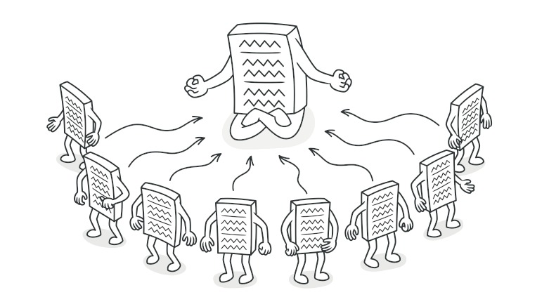
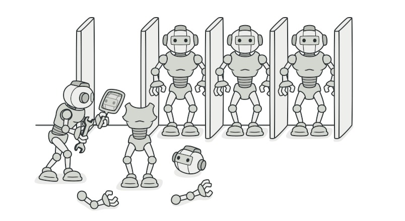
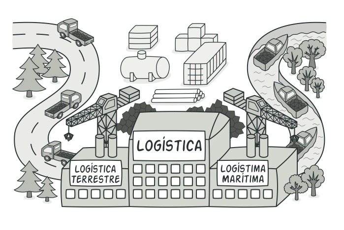
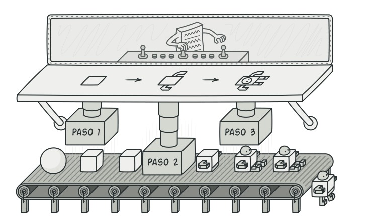

## Patrones creacionales
>Incrementan la reutilización de codigo y la flexibilidad por los mecanismos de creación de objetos.
## Patrones estructurales
>Explican como ensamblar objetos y clases en estructuras más grandes a la vez que se mantiene la flexibilidad y eficiencia de la estructura.
## Patrones de comportamiento
>Explican la comunicación efectiva y asignación de responsabilidades entre objetos.

# Patrones creacionales
  ## Singleton
  Permite asegurarnos de que una clase tenga una única instancia, a la vez que proporciona un punto de acceso global a dicha instancia.
  
  
  >

  [Singleton...](estructurales/singleton/README.md)
  >
  ## Prototype:
  Patrón de diseño creacional que nos permite copiar objetos existentes sin que el código dependa de sus clases.  
  

  >
  ## Factory Method:
  
  

  >
  ## Builder:
  
  

  >

  

# Patrones estructurales
    - Decorator
      - Permite añadir funcionalidades a objetos colocando estos objetos dentro de objetos encapsuladores especiales que contienen estas funcionalidades.
    - Adapter
      - Patrón de diseño estructural que permite la colaboración entre objetos con interfaces incompatibles.